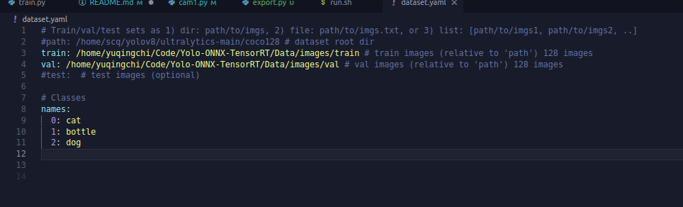

# 环境配置
## 安装显卡驱动
```
ubuntu-drivers devices
```
找到带有recommended

```
sudo apt install 带有recommended的
例如sudo apt install nvidia-driver-575 - distro non-free

```

## 下载anaconda
https://mirrors.tuna.tsinghua.edu.cn/anaconda/archive/

这个清华源，下载anaconda3

使用如下命令

```
bash 文件路径
```

## 安装cuda+torch
这个版本
torch-2.3.1+cu118-cp310-cp310-linux_x86_64.whl
```
pip install torch-2.3.1+cu118-cp310-cp310-linux_x86_64.whl
```
## 安装labelIMg
安装libelImg
conda create -n use_labelimg python=3.6

conda activate use_labelimg

pip install labelimg -i https://pypi.tuna.tsinghua.edu.cn/simple

执行命令打开：labelImg

## YoloV13
https://github.com/iMoonLab/yolov13
按照这个教程走就行
clone下来就可以
但是里面的torch和torchvision要手动安装，避免它自动安装错误

## 糖 
 如果import不到yolo需要去使用scripts里的脚本，把yolo文件夹加载到path

# 关于YOLO训练

主要函数:model.train
example:
```py
    model.train(
        data=r'/home/yuqingchi/Code/Yolo-ONNX-TensorRT/dataset.yaml',
        imgsz=640,
        epochs=30,
        batch=4,
        workers=2,
        device="0",
        optimizer="SGD",
        close_mosaic=10,
        resume=False,
        project="runs/train",
        name="exp",
        single_cls=False,
        cache=False,
    )
```

参数说明：
data:训练的数据，其中需要加载特定格式的yaml


imgsz：输入的图像会被调整成这个大小

epochs：训练的轮数

batch：单次提取数据个数

workers：用于数据加载的子进程数量

optimizer：优化器

device：CPU/GPU

close_mosaic：给定数字，在训练的最后 N 个 epoch 关闭马赛克数据增强
马赛克增强将多张图像拼接成一张进行训练

resume： 是否从之前中断的训练中恢复。为False就从头开始训练，为True就自动从上次保存的最新检查点（通常是 last.pt）恢复训练。这会加载模型权重、优化器状态、epoch 计数等信息，无缝继续训练。常用于训练意外中断的情况。

device：就是设备

project：指定保存训练结果（日志、权重等）的根目录。

name：每次训练结果

# OnnxRuntime

官方文档
https://onnxruntime.ai/docs/install/

OnnxRuntime是深度学习的推理引擎

它实现了任意学习框架出来的模型都可以被onnx推理，同时实现了在框架与底层硬件的解耦，不需要挑torch/tensorflow都可以跑，并且不挑cpu/gpu。

并且提供了sdk不需要挑语言

```
# 1. 安装依赖
pip install flatbuffers numpy packaging protobuf sympy 

# 2. 安装与 CUDA 11.8 兼容的 ONNX Runtime GPU 版本
pip install onnxruntime-gpu --index-url https://aiinfra.pkgs.visualstudio.com/PublicPackages/_packaging/onnxruntime-cuda-118/pypi/simple/

# 3. 使用export.py导出onnx格式
from yolov13.ultralytics import YOLO

model = YOLO('/home/yuqingchi/Code/Yolo-ONNX-TensorRT/runs/train/exp8/weights/best.pt')
model.export(format="onnx",half =True)

这个half指的是半精度，会更节省时间，但是牺牲精度
```

