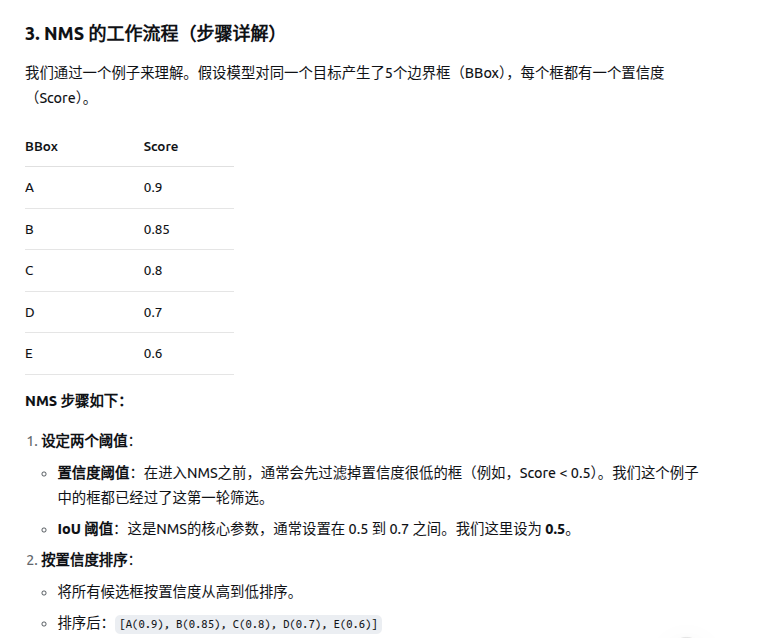
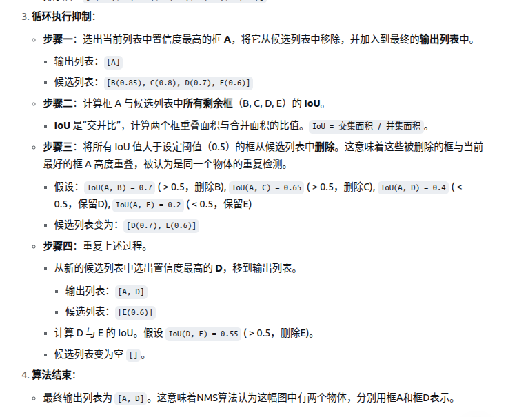

# IoU交并比
衡量两个区域的重叠程度的

计算方式：用两个区域的 交集面积 除以它们的 并集面积。

取值范围在0～1之间。

# NMS

## 概述

NMS 的核心思想很简单：从一堆重叠的候选框中，选出最好的那个，同时抑制（即删除）其他冗余的框。

## 算法流程




## 代码解释
```py
def nms(boxes, scores, threshold=0.5):
#boxes: 边界框数组，格式为 [x, y, width, height]
#scores: 每个边界框的置信度分数
#threshold: IoU阈值，默认0.5
    x1 = boxes[:, 0]
    y1 = boxes[:, 1]
    x2 = boxes[:, 0] + boxes[:, 2]
    y2 = boxes[:, 1] + boxes[:, 3]
#X1/Y1是左上角
#X2/Y2是右下角
#注意在图像坐标系中，图片左上角是原点，所以右下角是加
    areas = (x2 - x1) * (y2 - y1)
    order = scores.argsort()[::-1]
#argsort是升序排列，加一个[::-1]，进行倒序
#而且这个order储存的是，原scores储存的索引顺序，不是对应的值的大小
    keep = []
#创建空的队列
    while order.size > 0:
        i = order[0]
        keep.append(i)
#算交集的坐标,注意这个是与所有的剩下的元素，一起取交集
        xx1 = np.maximum(x1[i], x1[order[1:]])
        yy1 = np.maximum(y1[i], y1[order[1:]])
        xx2 = np.minimum(x2[i], x2[order[1:]])
        yy2 = np.minimum(y2[i], y2[order[1:]])

        w = np.maximum(0.0, xx2 - xx)1
        h = np.maximum(0.0, yy2 - yy1)
        inter = w * h

        ovr = inter / (areas[i] + areas[order[1:]] - inter)
        inds = np.where(ovr <= threshold)[0]
#这个也是返回的索引，ovr和order是对应的 
        order = order[inds + 1]

    return keep

```


