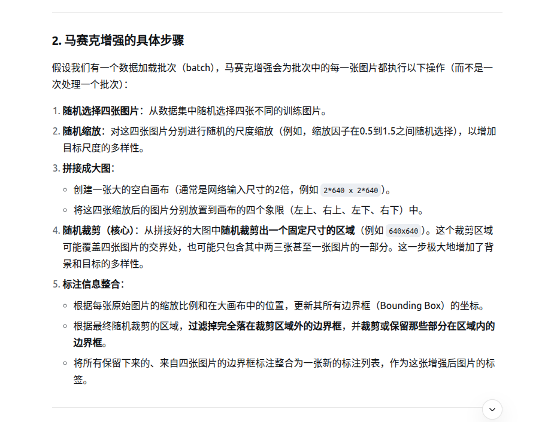

https://blog.ailemon.net/2020/09/28/mosaic-data-augment-principle-and-implement/
学习链接

马赛克增强是一种在训练阶段使用的、强大的数据增强（Data Augmentation）方法。它的核心思想是将四张训练图像以随机缩放、随机裁剪和随机排布的方式拼接成一张复合图像，并相应地整合这四张图片的标注信息（边界框和类别）。

其优势

提高泛化能力————一张图片中同时包含来自四个不同场景的目标，迫使模型学习在更复杂、更多样的背景中识别物体，

增强小目标检测能力————原始图片中的目标经过缩放后，可能会变得更小。这相当于为模型提供了大量免费的小目标训练样本。模型通过大量学习这些小目标，其检测微小物体的能力显著增强。